Calculate Forest Change
========================

Computing Forest Loss
_______________________

.. note::
   The current release of the MISLAND-North Africa uses the High resolution Hansen Global forest Change data to compute forest loss for selected area and year.

To compute forest loss using the Hansen Global forest change dataset;

1. On the top left conner of the Map pannel, click on the |drowpolygon| 'Draw a Polygon' tool and draw an area on the map where you wish to compute the forest loss

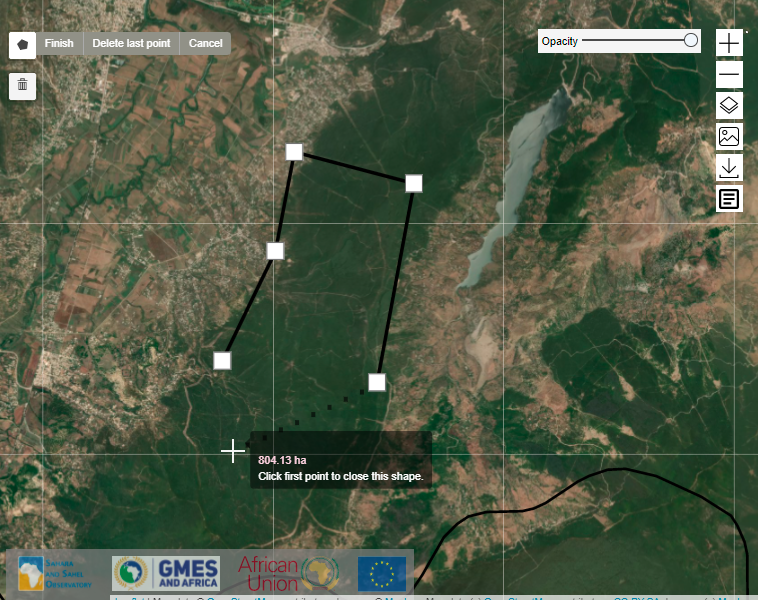

    Draw a polygon tool

2. Select |forestloss| option from the |forest1| service indicator menu-bar, choose 'Hansen' and select the year you wish to compute the forest loss from th pop-up that appears.

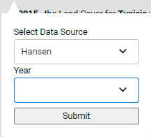

    Selecting the Hansen Forest loss data

The map and computed statistics will be displayed on the map panel and summary pannel respectively.

Forest Carbon Emission
_______________________
 Select |carbonbtn| option from the |forest1| service indicator menu-bar fill in the parameters required and clck on the |submit| button

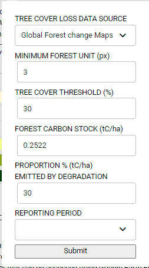

    Forest carbon emission pop-up

Forest Fire Risk
__________________
Select |fireriskbtn| option from the |forest1| service indicator menu-bar fill in the parameters required and clck on the |submit| button

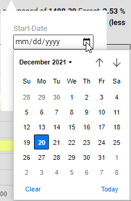

    Forest carbon emission pop-up

Computing Forest Fires
_______________________

1. Select the |firebtn| option from the |forest1| service indicator menu-bar

2. On the layer options, select the pre and post fire dates using the calender

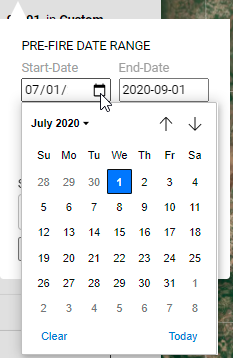

    Selecting the date from the calender tool.

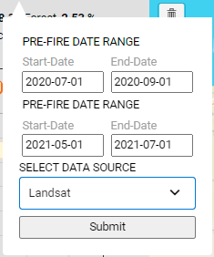

    Pre-fire and Post-fire dates

3. Choose the platform to use to compute the burnt area

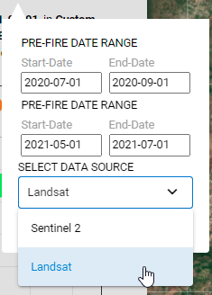

    Choosing the Platform/Sensor for computing forest fires.

The output showing the extent and severity of the fire will be as shown below

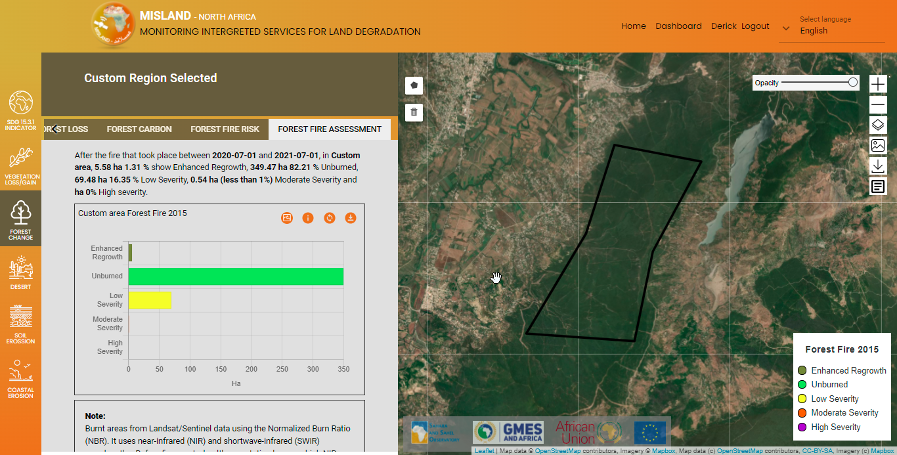

    Forest-fire Output.    

.. toctree::
   :maxdepth: 3

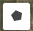
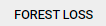
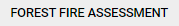
.. |submit| image:: ../_static/Images/Service/submit.png
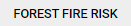
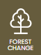
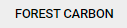