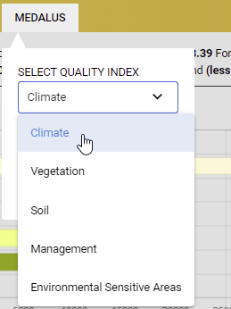
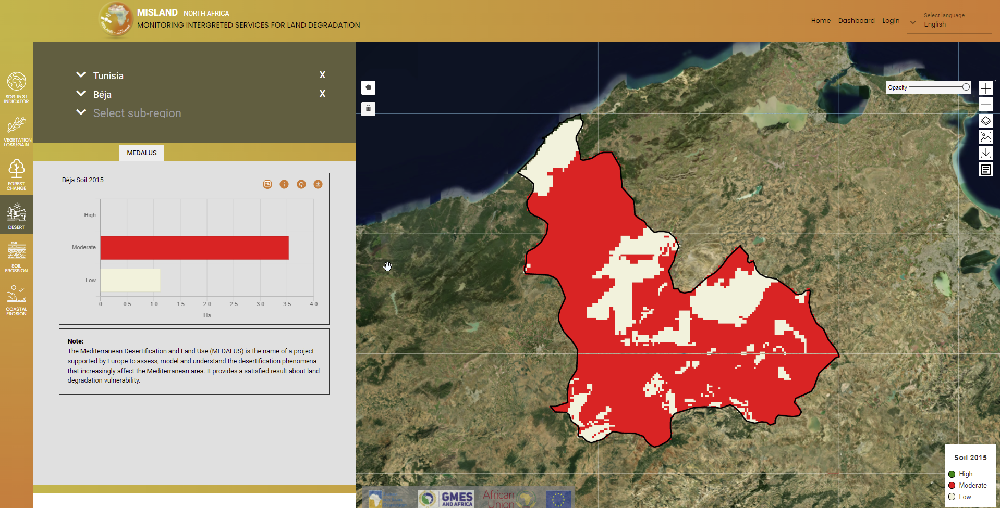
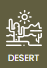
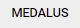

Calculating Sensitivity to Desertification (MEDALUS)
=====================================================
Land degradation and desertification (LDD) analysis is done using the MEDALUS–(Mediterranean Desertification and Land Use Model, a series of international cooperation research projects funded by the European Union) is used worldwide to identify 'sensitive areas' that are potentially threatened by land degradation and desertification (LDD). The distinctive outcome of the approach is a multidimensional index (the ESAI) composed of partial indicators of climate, soil, vegetation, and management quality that are derived from the elaboration of 14 elementary variables.

All the varialbes are grouped into four Quality Indicators (Soil quality, SQI; vegetation quality, VQI; climate quality, CQI; and management quality, MQI), which were estimated as the geometric mean of the respective scores of the elementary variables.

Calculating Individual Quality Indicators
___________________________________________
The current implementation of the MEDALUS model in MISLAND overcomes the problem of no data by computing the geometric mean of Individual Quality Indicators by using the variables with available information for any of the elementary variables.

.. note::
   To upscale the model for regional analysis, the following cosiderations were made for the selection of variables to be used in the computation of individual Quality indices: (a) Consistancy with the original MEDALUS Approach; (b) Time-series data availability and regularity for multi-temporal analysis; and (c) data source quality and reliability for future updates.

To compute the individual quality indicators(Soil quality, SQI; vegetation quality, VQI; climate quality, CQI; and management quality, MQI), Follow the following simple steps:

1. On the service menu-bar select the |deserticon| option and click on the |medalusbtn| for the layer settings pop-up to appear.

2. On the layer settings options select the Quality index to compute from the dropdown list and the year you wish to compute:

    Selecting the Quality index to compute form the dropdown list

Click on the |submit| button and the resultant layer and statistics will be computed and visualized as shown

    Results for SQI computation

.. toctree::
   :maxdepth: 3

.. |submit| image:: ../_static/Images/Service/submit.png